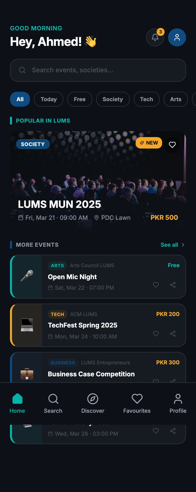
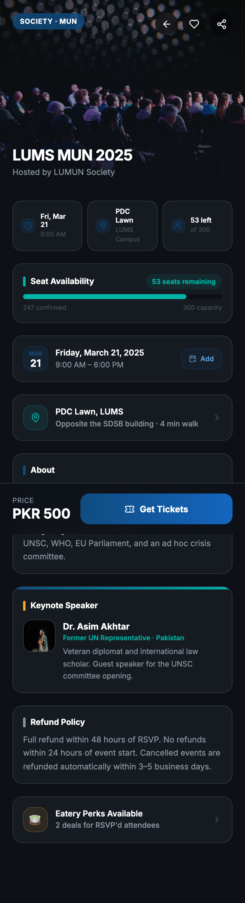
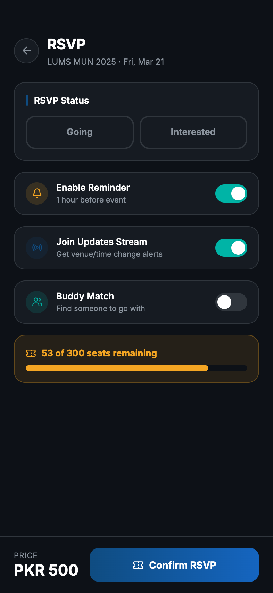
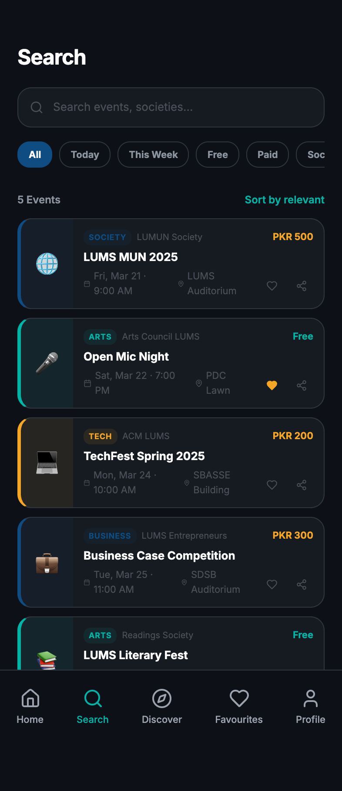
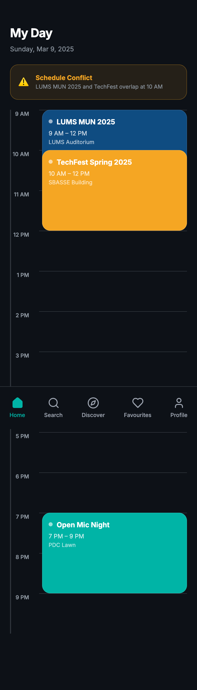
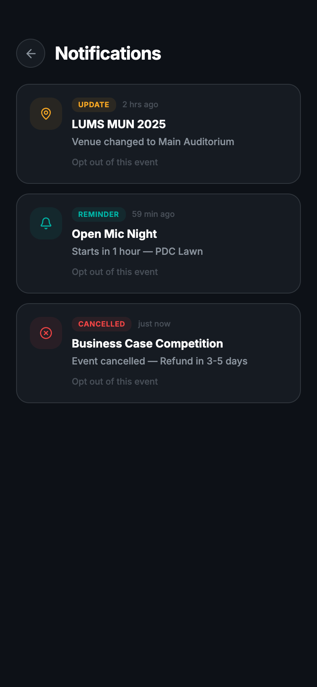
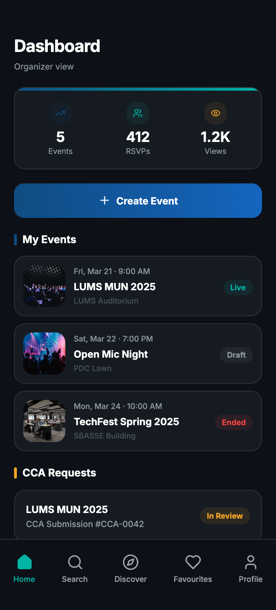
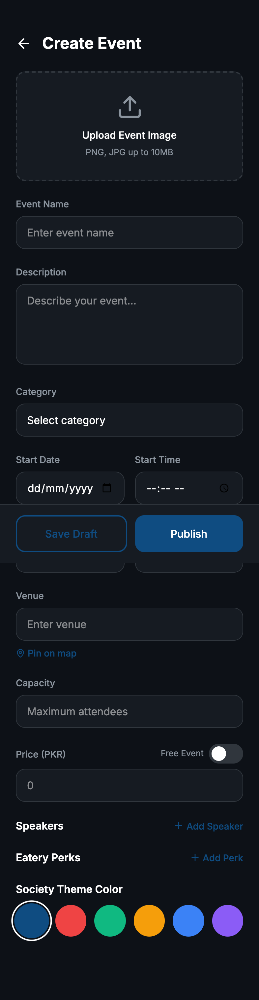
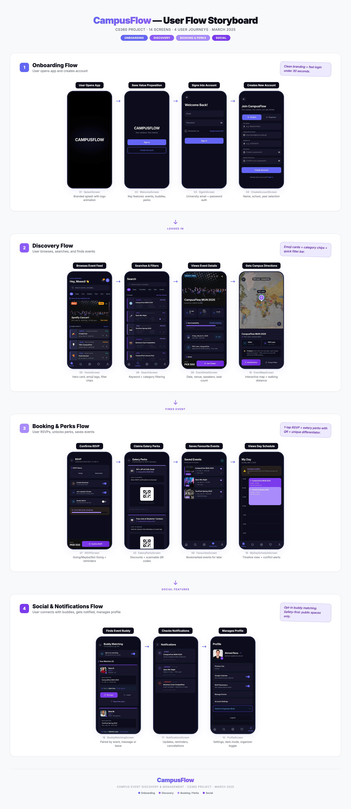
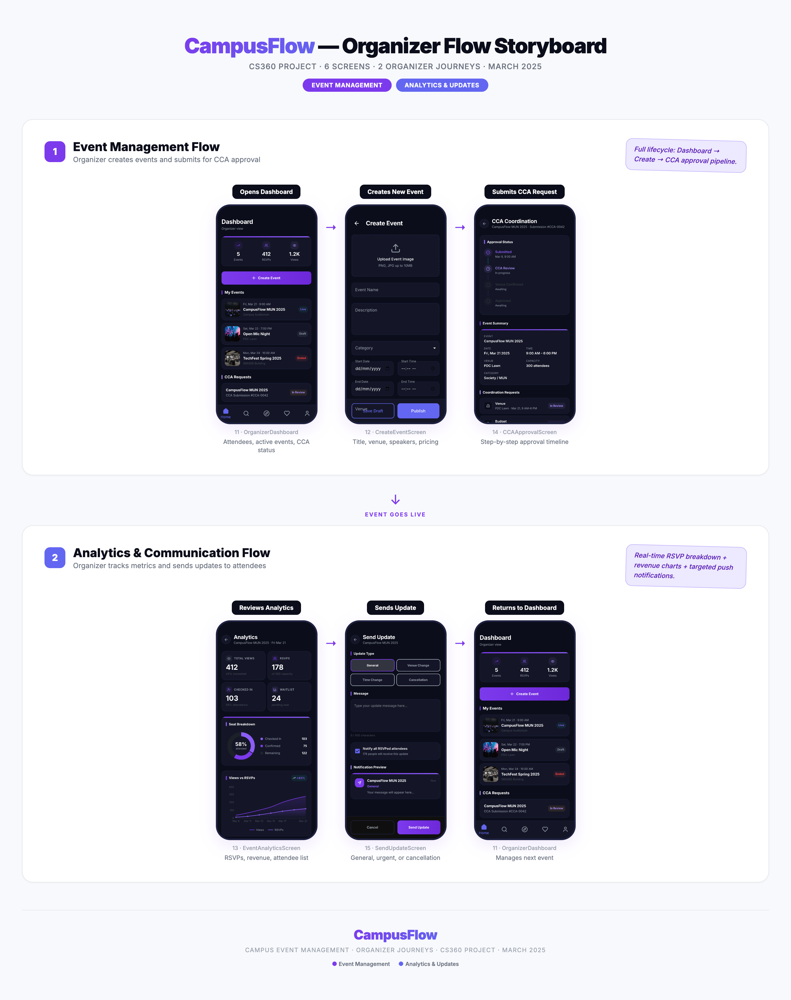

# Campus Event Discovery & Management Platform

## Quick Links
- **GitHub Project (Backlog + Board):** https://github.com/orgs/CS360S26tokens/projects/5
- **Figma Wireframes:** https://net-notice-77687535.figma.site

---

## Team Information

- **Team Name:** Tokens
- **Course:** CS360
- **Project Choice:** Project 1 — Campus Event Discovery and Management Platform

| Name | Roll Number | GitHub Handle | Primary Responsibility |
|------|-------------|---------------|------------------------|
| Ayaan Arif Aziz | 27100079 | @AyaanArifAziz | Discovery / Schedule |
| Bilal Awan | 27100187 | @Billthebest7306 | Filters / UI / Speaker Detail |
| Abdul Moeed | 27100186 | @MK-notageek | RSVP / Capacity / Reminders |
| Rana Fawad Tahir | 27100428 | @rfawadt | Organizer Flows / Admin |
| Shehryar Asif | 27100121 | @shehry4rr | Search / Updates / Attendance |

---

## Project Overview

Campus Event Discovery & Management Platform is a centralized mobile-first Android application for discovering, browsing, and managing campus events at LUMS. The platform serves two primary user types:

- **Students** — discover events, RSVP, track their schedule, see updates
- **Organizers** — create/edit/cancel events, post updates, view RSVP lists, manage capacity

### Problem Statement

Students often miss campus events because information is scattered across Instagram stories, society pages, and informal word-of-mouth. This app creates a single platform where students can discover and track events, and organizers can manage events in a structured way.

---

## Technical Stack

| Component | Technology |
|-----------|-----------|
| Language | Java |
| Architecture | MVVM (ViewModel + LiveData) |
| Navigation | Jetpack Navigation Component |
| UI | Material Design 3 (Dark Theme) |
| Min SDK | 24 (Android 7.0) |
| Target SDK | 34 (Android 14) |
| Build Tool | Gradle 8.2 with Groovy DSL |
| Data | Hardcoded mock data (no backend) |

---

## How to Run

1. Open the project folder in **Android Studio Hedgehog** or later
2. Wait for Gradle sync to complete
3. Run on an emulator or physical device (API 24+)
4. **Login screen** — select Student or Organizer role and tap Sign In

---

## Screens Implemented

| # | Screen | Description |
|---|--------|-------------|
| 1 | Login / Role Selection | Student vs Organizer toggle with email/password fields |
| 2 | Home / Event Feed | Greeting, search bar, category chips, featured + event list |
| 3 | Event Detail | Full event info, seat availability, venue hints, updates |
| 4 | RSVP Confirmation | Going/Interested selection, toggles, capacity display |
| 5 | Search | Keyword search with filter chips and results |
| 6 | Filter Sheet | Category, location, online/offline filters |
| 7 | My Events (Favourites) | Saved events + My RSVPs with tab switching |
| 8 | My Day Schedule | Timeline view of RSVP'd events with conflict detection |
| 9 | Notifications | Update, reminder, and cancellation notifications |
| 10 | Profile | User info, settings, organizer mode switch |
| 11 | Organizer Dashboard | Stats, create event button, event list with status |
| 12 | Create Event | Full form with date/time pickers, category, capacity |
| 13 | Edit / Cancel Event | Pre-filled form with save and cancel options |
| 14 | RSVP List | Going/interested counts with attendee list |
| 15 | Post Update | Type selection, message, notification preview |

---

## Halfway Checkpoint — Implemented User Stories

| ID | User Story | Story Points | Status |
|----|-----------|:---:|:---:|
| US-01 | Unified feed of upcoming campus events | 5 | Done |
| US-03 | "Today" view for events happening today | 2 | Done |
| US-04 | Search events by keyword | 3 | Done |
| US-05 | Filter events by category | 3 | Done |
| US-06 | Filter by location / online vs offline | 5 | Done |
| US-07 | Follow organizers/societies | 5 | Done |
| US-09 | Detailed event page with full info | 3 | Done |
| US-11 | Clear venue details on event page | 3 | Done |
| US-12 | RSVP as Going or Interested | 5 | Done |
| US-15 | Cancel RSVP | 3 | Done |
| US-16 | My Events dashboard (upcoming + past RSVPs) | 5 | Done |
| US-19 | View updates posted for an event | 5 | Done |
| US-21 | Share an event (Android share intent) | 2 | Done |
| US-22 | Enforce capacity (Going RSVPs cannot exceed limit) | 8 | Done |
| US-28 | "My Day" schedule built from RSVPs | 5 | Done |
| ORG-01 | Organizer: Create an event | 8 | Done |
| ORG-02 | Organizer: Edit or cancel an event | 5 | Done |
| ORG-03 | Organizer: View RSVP list and counts | 5 | Done |
| ORG-04 | Organizer: Post event updates | 5 | Done |

**Total Story Points (Halfway): 85**

---

## Project Structure

```
CampusEvents/
├── app/
│   ├── build.gradle.kts
│   ├── src/main/
│   │   ├── AndroidManifest.xml
│   │   ├── java/com/tokens/campusevents/
│   │   │   ├── CampusEventsApplication.java
│   │   │   ├── LoginActivity.java
│   │   │   ├── MainActivity.java
│   │   │   ├── data/
│   │   │   │   ├── model/       (6 data classes)
│   │   │   │   └── repository/  (EventRepository, UserRepository, MockData)
│   │   │   └── ui/
│   │   │       ├── adapter/     (7 RecyclerView adapters)
│   │   │       ├── home/        (HomeFragment + ViewModel)
│   │   │       ├── search/      (SearchFragment + ViewModel + FilterSheet)
│   │   │       ├── discover/    (DiscoverFragment + ViewModel — My Day)
│   │   │       ├── favorites/   (FavoritesFragment + ViewModel — My Events)
│   │   │       ├── profile/     (ProfileFragment + ViewModel)
│   │   │       ├── eventdetail/ (EventDetailFragment + ViewModel)
│   │   │       ├── rsvp/        (RsvpFragment + ViewModel)
│   │   │       ├── notifications/ (NotificationsFragment + ViewModel)
│   │   │       └── organizer/   (Dashboard, Create, Edit, RsvpList, PostUpdate)
│   │   └── res/
│   │       ├── layout/      (22 XML layouts)
│   │       ├── drawable/    (29 icons + backgrounds)
│   │       ├── menu/        (bottom_nav_menu.xml)
│   │       ├── navigation/  (nav_graph.xml)
│   │       └── values/      (colors, strings, themes, dimens)
├── docs/
│   ├── figma-screens/    (20 Figma wireframe PNGs)
│   ├── storyboards/      (User + Organizer storyboard PNGs)
│   ├── guidelines/       (Guidelines.md)
│   └── PROJECT_README.md (original project documentation)
├── build.gradle
├── settings.gradle
├── gradle.properties
├── README.md          (this file)
├── README_DEV.md      (developer guide)
└── ROLES.md           (team roles + commit assignments)
```

---

## Changelog

### April 1, 2026 — Bug Fix Pass (commit `8881958`)

Addressed all gaps identified in peer review where user stories were marked **Done** in the table above but not fully wired in the UI.

| # | Issue | Fix | Files |
|---|-------|-----|-------|
| P1 | Search chip callback was empty — selecting a chip had no effect | Wired chips to `SearchViewModel.setCategory()` / `setFreeFilter()`; added filter icon that opens `FilterBottomSheetFragment` | `SearchFragment`, `SearchViewModel`, `fragment_search.xml` |
| P1 | `FilterBottomSheetFragment` Apply/Clear only dismissed — no filters applied | Apply now reads chip group + online/offline state, writes results to `NavBackStackEntry.SavedStateHandle`; SearchFragment observes and applies them | `FilterBottomSheetFragment`, `SearchFragment` |
| P1 | Follow/Unfollow UI missing from EventDetail despite VM + repo support | Added `btn_follow` to event detail layout, wired to `toggleFollow()` with live state toggle (Follow ↔ Following) | `EventDetailFragment`, `fragment_event_detail.xml` |
| P1 | Cancel RSVP button not exposed in RSVP screen despite `cancelRsvp()` existing | Added `btn_cancel_rsvp` (hidden by default, shown when RSVP exists), wired to `RsvpViewModel.cancelRsvp()` | `RsvpFragment`, `fragment_rsvp.xml` |
| P2 | My Events only had Saved / My RSVPs — no Upcoming/Past split | Added sub-tab row (Upcoming / Past) under My RSVPs; backed by `loadUpcomingRsvpEvents()` and `loadPastRsvpEvents()` with real date filtering | `FavoritesFragment`, `FavoritesViewModel`, `fragment_favorites.xml` |
| P2 | My Day loaded all GOING RSVPs regardless of date | `loadSchedule()` now filters to events whose `event.date` matches today. Added `evt_9` (April 1 2026) to MockData with GOING RSVP so screen is non-empty | `DiscoverViewModel`, `MockData` |
| P2 | Home feed included ENDED events | `getAllEvents()` now excludes both `CANCELLED` and `ENDED` status | `EventRepository` |
| ORG | View RSVPs + Send Update were unreachable from Organizer Dashboard | Added per-event action buttons to each organizer event card; wired to `nav_rsvp_list` and `nav_post_update` | `OrganizerEventAdapter`, `OrganizerDashboardFragment`, `item_organizer_event.xml` |

---

## Wireframes

See `docs/figma-screens/` for all 20 Figma wireframe exports, or visit [the Figma prototype](https://net-notice-77687535.figma.site).

Key screens:

| Home | Event Detail | RSVP | Search |
|:----:|:----------:|:----:|:------:|
|  |  |  |  |

| My Day | Notifications | Organizer Dashboard | Create Event |
|:------:|:------------:|:------------------:|:------------:|
|  |  |  |  |

---

## Storyboards

**User Flow:**


**Organizer Flow:**


---

## Contribution Summary

See [ROLES.md](ROLES.md) for detailed file assignments and git commit instructions.

| Team Member | Files | User Stories |
|-------------|:-----:|:------------|
| Ayaan Arif Aziz | 20 | US-01, US-03 (Data layer + Home) |
| Bilal Awan | 38 | US-01, US-05, US-19, US-28, ORG-03 (UI + Adapters) |
| Abdul Moeed | 14 | US-12, US-15, US-16, US-22, US-28 (RSVP + Navigation) |
| Rana Fawad Tahir | 13 | ORG-01, ORG-02, ORG-03, ORG-04 (Organizer flows) |
| Shehryar Asif | 24 | US-04, US-06, US-07, US-09, US-11, US-19, US-21 (Search + Detail) |
